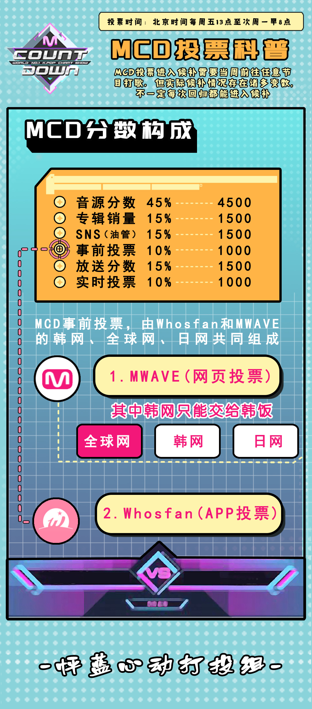
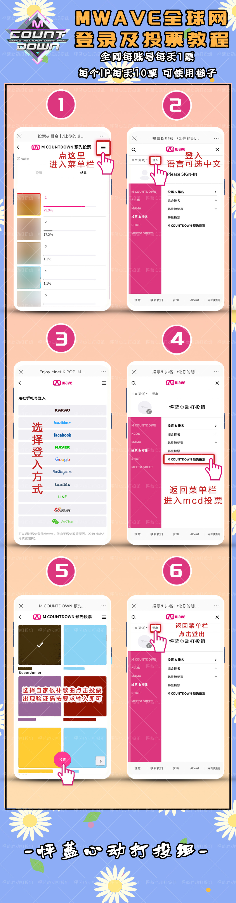
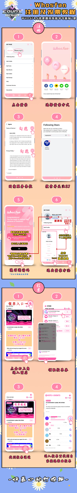

# 打歌节目规则及投票组成
---
# 全球网投票
### 投票时间：每周五下午 1 点至第二周周一上午 8 点 
### 投票地址：[https://www.mwave.me/cn/](https://www.mwave.me/cn/)
### 每个账号每天1票，每个IP每天10票，可以使用梯子或流量上网模式下开关飞行模式切换IP投票。
---

# 日网投票
###  投票时间：每周五下午 1 点至第二周周一上午 8 点
###  投票地址：[https://mnetjp.com/](https://mnetjp.com/)
###  每账号每天1票，每个IP每天2票，可以使用你懂的或流量上网下开关飞行模式切换IP投票。
---
# whosfan app投票
### 投票时间：每周五下午 1 点至第二周周一上午 8 点
### 每账号投票期间可领取1票用于投票。事前投票不需要刻意攒积分，投票即可。

